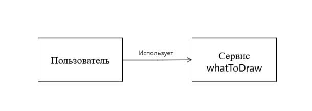
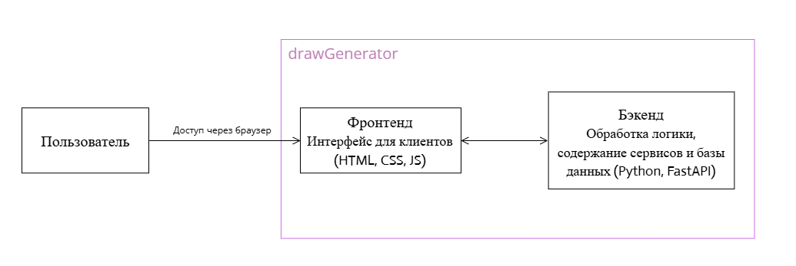
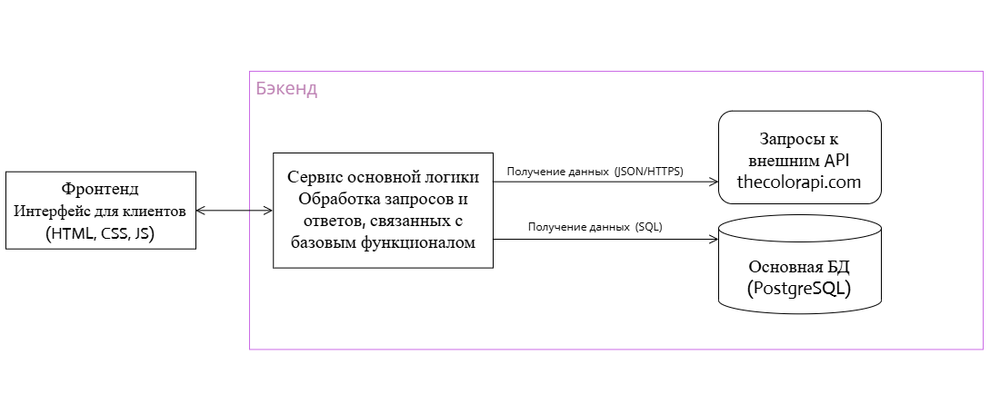
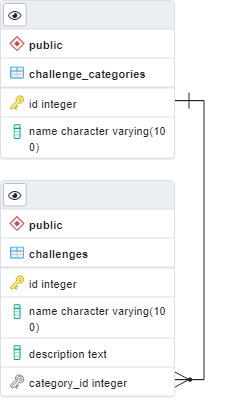

# whatToDraw - Генератор творческого задания

### Веб-приложение для генерации случайных цветов, слов и творческих заданий с таймером для художников, дизайнеров и креативных специалистов
##
Ссылка на продукт, полученный с помощью Render.com - https://whattodraw.onrender.com/.
##
> Фронтенд: <br/>
  * HTML 
  * CSS 
  * JavaScript 
  * Bootstrap <br/>
>

> Бэкенд: <br/>
  * Python 
  * FastAPI 
  * Jinja2 <br/>
>

> База данных: <br/>
  * PostgreSQL 
  * SQLAlchemy ORM

> Внешние зависимости: <br/>
  * The Color API 
  * Mimesis Library

## Участники
| ФИО | Группа |
|-----|--------|
| Дробчик Анжелика Витальевна | 5130904/30101 |


## Определение проблемы
Художникам, дизайнерам и креативным специалистам часто не хватает вдохновения для начала новой работы. Выбор цвета, темы и формата задания может занимать много времени и отвлекать от самого творческого процесса. Необходим инструмент, который мгновенно генерирует случайную комбинацию элементов для творческого вызова.

## Выработка требований

### Пользовательские истории
1. Как художник, я хочу получать случайный цвет с названием и HEX-кодом, чтобы использовать его в качестве основной палитры для работы.
2. Как дизайнер, я хочу получать случайное слово-тему, которое станет основой для креативной концепции.
3. Как иллюстратор, я хочу получать случайное творческое задание/усложнение (временное ограничение, стиль, композиция), чтобы бросить себе вызов.
4. Как пользователь, я хочу копировать HEX-код цвета одним кликом, чтобы быстро использовать его в графических редакторах.
5. Как пользователь, я хочу управлять таймером для заданий с временными ограничениями (старт, пауза, сброс), чтобы контролировать время работы.
6. Как пользователь, я хочу обновлять отдельные элементы или всю комбинацию целиком, чтобы быстро перебрать варианты.

## Разработĸа архитеĸтуры и детальное проеĸтирование

### Оценка масштаба 
10 000 активных пользователей/сутки; период хранения данных: > 5 лет.

### Диаграммы C4 Model
Контекст:



Контейнеры:



Компоненты:



### Схема БД




## Unit-тестирование
Для запуска unit-тестов (frontend + backend) используется Docker и bash, на хосте достаточно установленного Docker.

- **Unit-тесты**: `pytest tests/test_*.py` проверяют:
    * Генерацию цветов (интеграция с The Color API)
    * Генерацию слов (библиотека Mimesis)
    * Работу с базой данных (CRUD операции)
    * Валидацию времени для таймера
    * JavaScript функции управления таймером, копирования текста, анимаций

Оба набора тестов запускаются автоматически через общий скрипт.

## Интеграционное тестирование
Интеграционные тесты находятся в `tests/test_app_integration.py` и покрывают полные пользовательские сценарии:

- **Полный пользовательский поток:** загрузка главной страницы → генерация отдельных элементов → генерация полной комбинации
- **Работа с таймером:** инициализация → старт → пауза → сброс → окончание времени
- **Взаимодействие с API:** проверка всех REST эндпоинтов (`/api/random-color`, `/api/random-word`, `/api/random-challenge`, `/api/random-all`)
- **Работа с БД:** создание тестовых данных → выбор случайного задания → проверка корректности категорий


## Сборка и запуск
В проекте есть Docker Compose и Makefile, которые выполняют полный цикл «сборка → unit-тесты → интеграционные тесты → запуск приложения» в одной команде.

### Одной командой

- **Требования**: установлен `docker` и docker-compose (или make для альтернативного запуска)
- **Команда** (из корня репозитория):

```bash
docker-compose up --build
```

Или через Makefile:

```bash
make all
```

После успешного выполнения:

- Приложение будет доступно по адресу: `http://localhost:8000`
- API будет доступно по адресу: `http://localhost:8000/api/*`